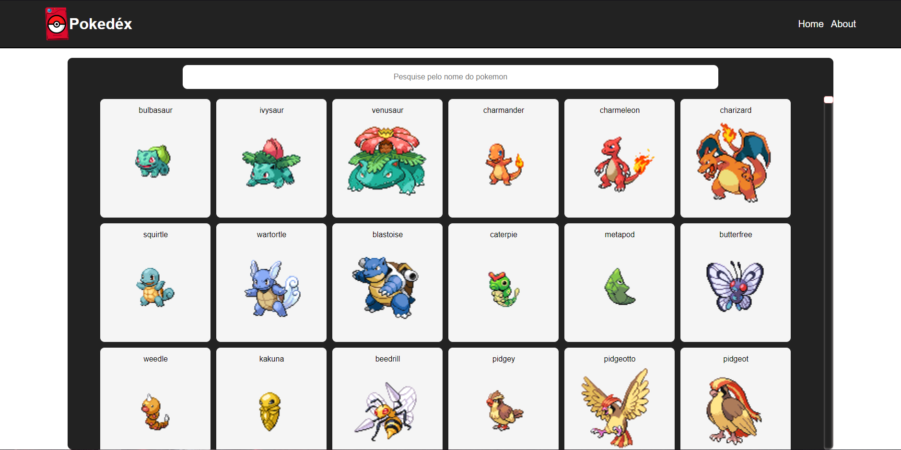

# pokedex

Projeto feito utilizando o framework VueJS

API: https://pokeapi.co

É possível realizar a busca do pokémon pelo nome utilzando a barra de pesquisa

[Confira o aplicativo funcionando](jonatas00-pokedex.vercel.app)